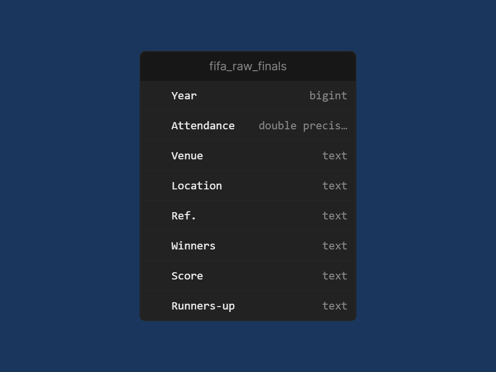
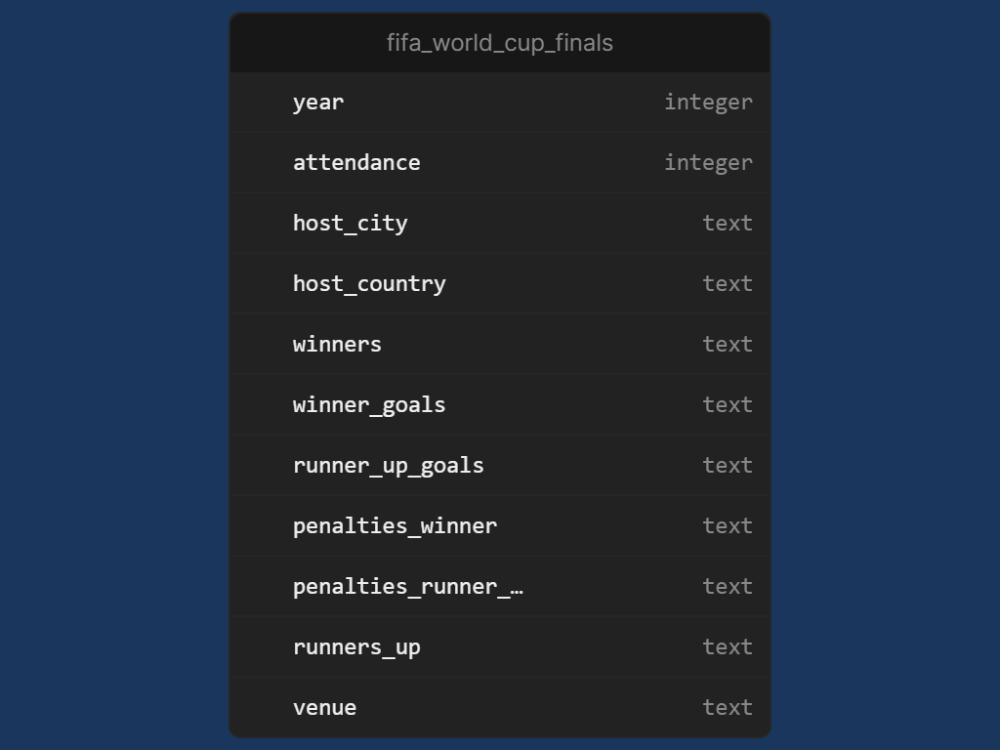

# Data Engineer Challenge
## Español
##  Descripción general

Este proyecto consiste en construir un pequeño pipeline de datos para extraer, transformar y analizar los resultados de las finales de la Copa Mundial de la FIFA, usando herramientas modernas como Airflow, Docker, PostgreSQL y dbt.

----------

## Estructura del proyecto

```
fifa_world_cup_data_pipeline/
├── scrapping/           # Código Python para extraer datos de Wikipedia
├── dags/                # DAGs de Airflow para orquestar el pipeline
├── transformation/      # Proyecto dbt para transformar los datos
├── docker-compose.yml   # Infraestructura local con Docker
├── Dockerfile           # Imagen personalizada para Airflow + dependencias
├──queries			     #Consultas SQL que demuestran la utilidad del dataset final
├──postgres				 #Archivos de configuración inicial para la base de datos.
├── .env.example         # Variables de entorno necesarias
└── README.md            # Este archivo

```

----------

##  ¿Qué hace este proyecto?

-   **Extraer (E):** Un script Python utiliza `requests` y `pandas` para obtener la tabla de resultados de Wikipedia.
    
-   **Cargar (L):** El DAG de Airflow (`dags/`) usa `psycopg2` para cargar los datos _crudos_ directamente al _schema raw_ en PostgreSQL.
    
-   **Transformar (T):** **dbt** (Data Build Tool) se ejecuta sobre el _schema raw_ para aplicar lógica de negocio y limpieza, creando el modelo final analítico (`fifa_world_cup_finals`).
----------

## Stack tecnológico

-   **Docker + Docker Compose**: Infraestructura local
-   **PostgreSQL**: Base de datos relacional
-   **Apache Airflow**: Orquestación de tareas

-   **dbt (Data Build Tool)**: Transformación de datos en SQL
-   **Outerbase Studio**: Cliente visual para PostgreSQL (alternativa a pgAdmin)

----------

## Cómo correrlo localmente

1.  Cloná el repo y creá tu archivo `.env`:

```bash
cp .env.example .env
```

2.  Completá tus credenciales en `.env`:

```env
POSTGRES_USER=tu_usuario
POSTGRES_PASSWORD=tu_password
AIRFLOW_SECRET_KEY=clave_secreta
AIRFLOW_USER=admin
AIRFLOW_PASSWORD=admin
```

3.  Levantá los servicios:

```bash
docker-compose up --build
```

4.  Accedé a Airflow en `http://localhost:8080` y ejecutá el DAG.

----------

##  Proceso de desarrollo


###  Setup inicial

-   Contenedor oficial de PostgreSQL (`fifa_world_cup_data_pipeline-postgres-1`) corriendo con Docker.
-   Conexión a la base usando **Outerbase Studio**, cliente minimalista de Bases de Datos SQL y Open Source.
-   DAG de Airflow que ejecuta el scraping y carga los datos crudos a PostgreSQL. 
	- Dado que la tabla de resultados del Mundial se actualiza solo **cada cuatro años**, el uso de Airflow podría considerarse excesivo. Sin embargo, se eligió Airflow para **demostrar la capacidad de orquestar** un pipeline completo.
-   Dockerfile personalizado con `pandas`, `requests`, `dbt-postgres`, `SQLAlchemy`, etc.

###  Transformación



| Columna | Tipo de Dato | Explicación y Origen |
| :--- | :--- | :--- |
| **`year`** | `integer` | Año en que se celebró la final del Mundial. |
| **`winners`** | `text` | Nombre del país ganador del partido. |
| **`runners_up`** | `text` | Nombre del país subcampeón (perdedor) del partido. |
| **`venue`** | `text` | Nombre del estadio o lugar donde se jugó la final. |
| **`attendance`** | `integer` | Número total de espectadores que asistieron a la final. |
| **`host_city`** | `text` | Ciudad anfitriona donde se celebró el partido. (Derivado de la columna `Location` original). |
| **`host_country`** | `text` | País anfitrión donde se celebró el partido. (Derivado de la columna `Location` original). |
| **`winner_goals`** | `integer` | Goles marcados por el equipo ganador durante el tiempo reglamentario y extra (excluyendo penales). (Derivado de la columna `Score` original). |
| **`runner_up_goals`** | `integer` | Goles marcados por el equipo subcampeón durante el tiempo reglamentario y extra (excluyendo penales). (Derivado de la columna `Score` original). |
| **`winner_penalties`** | `integer` | Goles marcados por el ganador en la tanda de penales (si aplica). **Si el partido no fue a penales, el valor es 0** para mantener la consistencia numérica y evitar nulos. |
| **`runner_up_penalties`** | `integer` | Goles marcados por el subcampeón en la tanda de penales (si aplica). **Si el partido no fue a penales, el valor es 0** para mantener la consistencia numérica y evitar nulos. |
-   Eliminé el año 2026 (datos incompletos) y la columna `Ref.` (utilizado sólo para referencias de Wikipedia).
-   Renombré columnas a snake_case.
-   Separé `score` en `winner_goals`, `runner_up_goals` `winner_penalties` y  `runner_up_penalties`.
-   Dividí `location` en `host_city` y `host_country`.

###  PostgreSQL + dbt
----------

-   Usé `psycopg2` para cargar el DataFrame a la base.
-   Implementé un modelo dbt llamado `fifa_world_cup_finals`.
-   Elegí un enfoque **Full Refresh (Truncate and Load)** por simplicidad e idempotencia:
    -   La tabla es pequeña.
    -   Solo cambia cada 4 años.
    -   Evita duplicados y garantiza reproducibilidad.


##  Consultas analíticas incluidas

-   Países con más finales jugadas
-   Países con más goles en finales
-   Final con mayor diferencia de gol
-   Países que cambiaron de estadio
-   Final con mayor asistencia
-   Finales decididas por penales

----------

##  A mejorar

-   Agregar tests de calidad de datos en dbt.
-   Automatizar validaciones con Great Expectations.
-   Agregar logs y monitoreo con Airflow + Slack.

## Referencias y Fuentes de datos

-   **Tutorial de Scraping:** [Jie Jenn Web Scraping Wikipedia tables using Python](https://www.youtube.com/watch?v=ICXR9nDbudk)
- **Fuente de Datos Principal (Scraping):** [List of FIFA World Cup finals](https://en.wikipedia.org/wiki/List_of_FIFA_World_Cup_finals)

---
## ENGLISH


## Project Overview

This project builds a small data pipeline to extract, transform, and analyze the results of FIFA World Cup finals using modern tools like Airflow, Docker, PostgreSQL, and dbt.

----------

## Project Structure

```
fifa_world_cup_data_pipeline/
├── scrapping/           # Python code to extract data from Wikipedia
├── dags/                # Airflow DAGs to orchestrate the pipeline
├── transformation/      # dbt project for data transformation
├── docker-compose.yml   # Local infrastructure with Docker
├── Dockerfile           # Custom image for Airflow + dependencies
├── queries  			 #SQL queries demonstrating the usefulness of the final dataset
├── postgres             #Initial database configuration files.
├── .env.example         # Required environment variables
└── README.md            # This file

```

----------

## What does this project do?

-   **Extract (E):** A Python script uses `requests` and `pandas` to fetch the results table from Wikipedia.
    
-   **Load (L):** The Airflow DAG (`dags/`) uses `psycopg2` to load the raw data directly into the _raw schema_ in PostgreSQL.
    
-   **Transform (T):** **dbt** (Data Build Tool) runs on the _raw schema_ to apply business logic and cleaning, producing the final analytical model (`fifa_world_cup_finals`).
    

----------

## Tech Stack

-   **Docker + Docker Compose**: Local infrastructure
-   **PostgreSQL**: Relational database
-   **Apache Airflow**: Task orchestration
-   **dbt (Data Build Tool)**: SQL-based data transformation
-   **Outerbase Studio**: Visual PostgreSQL client (alternative to pgAdmin)

----------

## How to run locally

1.  Clone the repo and create your `.env` file:

```bash
cp .env.example .env

```

2.  Fill in your credentials in `.env`:

```env
POSTGRES_USER=your_user
POSTGRES_PASSWORD=your_password
AIRFLOW_SECRET_KEY=secret_key
AIRFLOW_USER=admin
AIRFLOW_PASSWORD=admin

```

3.  Start the services:

```bash
docker-compose up --build

```

4.  Access Airflow at `http://localhost:8080` and run the DAG.

----------

## Development Process

### Initial Setup


-   Official PostgreSQL container (`fifa_world_cup_data_pipeline-postgres-1`) running via Docker.
-   Connected to the database using **Outerbase Studio**, a minimalist open-source SQL client.
-   Airflow DAG performs scraping and loads raw data into PostgreSQL.
    -   Since the World Cup results table updates only **every four years**, using Airflow might seem excessive. However, it was chosen to **demonstrate full pipeline orchestration**.
-   Custom Dockerfile includes `pandas`, `requests`, `dbt-postgres`, `SQLAlchemy`, etc.

### Transformation


| Column | Data Type | Explanation and Origin |
| :--- | :--- | :--- |
| **`year`** | `integer` | The year the World Cup final was held. |
| **`winners`** | `text` | Name of the winning country. |
| **`runners_up`** | `text` | Name of the runner-up country (losing finalist). |
| **`venue`** | `text` | Name of the stadium or place where the final was played. |
| **`attendance`** | `integer` | Total number of spectators who attended the final. |
| **`host_city`** | `text` | Host city where the match was held. (Derived from the original `Location` column). |
| **`host_country`** | `text` | Host country where the match was held. (Derived from the original `Location` column). |
| **`winner_goals`** | `integer` | Goals scored by the winning team during regular and extra time (excluding penalties). (Derived from the original `Score` column). |
| **`runner_up_goals`** | `integer` | Goals scored by the runner-up team during regular and extra time (excluding penalties). (Derived from the original `Score` column). |
| **`winner_penalties`** | `integer` | Goals scored by the winner in the penalty shootout (if applicable). **If the match did not go to penalties, the value is 0** to maintain numerical consistency and avoid nulls. |
| **`runner_up_penalties`** | `integer` | Goals scored by the runner-up in the penalty shootout (if applicable). **If the match did not go to penalties, the value is 0** to maintain numerical consistency and avoid nulls. |

-   Removed the year 2026 (incomplete data) and the `Ref.` column (used only for Wikipedia references).
-   Renamed columns to snake_case.
-   Split `score` into `winner_goals`, `runner_up_goals`, `penalties_winner`, and `penalties_runner_up`.
-   Split `location` into `host_city` and `host_country`.

### PostgreSQL + dbt

-   Used `psycopg2` to load the DataFrame into the database.
-   Implemented a dbt model named `fifa_world_cup_finals`.
-   Chose a **Full Refresh (Truncate and Load)** approach for simplicity and idempotency:
    -   The table is small.
    -   It only changes every 4 years.
    -   Avoids duplicates and ensures reproducibility.

----------

## Included Analytical Queries

-   Countries with most finals played
-   Countries with most goals in finals
-   Final with the largest goal difference
-   Countries that changed stadiums
-   Final with highest attendance
-   Finals decided by penalties

----------

## Improvements to Consider

-   Add data quality tests in dbt
-   Automate validations with Great Expectations
-   Add logging and monitoring with Airflow + Slack

## References and Data Sources

-   **Scraping Tutorial:** [Jie Jenn - Web Scraping Wikipedia tables using Python](https://www.youtube.com/watch?v=ICXR9nDbudk)
-   **Main Data Source (Scraping):** [List of FIFA World Cup finals](https://en.wikipedia.org/wiki/List_of_FIFA_World_Cup_finals)


